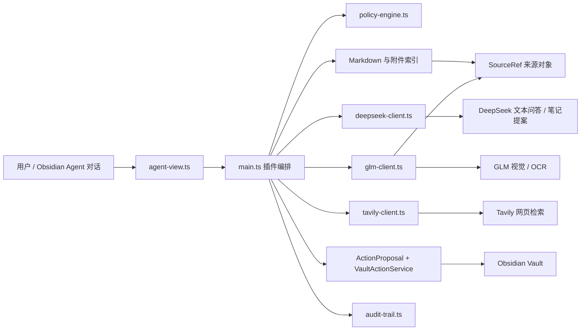

# Knowledge Loop Agent 项目接手指南

> 面向第一次接触 Obsidian 插件、TypeScript 和 Agent 的接手者。读完本文，应能知道项目为何存在、代码从哪里启动、每个文件负责什么、如何本地调试和怎样安全地改功能。

当前版本：`0.17.0`。项目根目录：`D:\develop\agent for obsidian`。

---

## 1. 用一句话理解项目

这是一个运行在 Windows 桌面版 Obsidian 中的个人知识 Agent：它能检索 Vault 内的 Markdown、经 GLM 解析 PDF/图片、用 Tavily 检索网页摘要并由 DeepSeek 直接回答；还能把现有笔记先组织为知识地图，再按节点生成新体系笔记，并在用户请求时基于来源完成知识回顾。

它不是通用聊天机器人。项目的重点是：**让模型参与个人知识库，但文件读取、外发、写入和来源记录仍由插件代码控制。**

## 2. 先记住这五条规则

1. `src/main.ts` 是唯一插件入口；Obsidian 加载它编译后的 `main.js`。
2. 三份 API Key 都不在 `data.json`，而在插件目录的本地 `.env` 中：`DEEPSEEK_API_KEY`、`GLM_API_KEY`、`TAVILY_API_KEY`。
3. 新装插件默认允许整个 Vault；用户填写“敏感目录”后，其中内容仍可本地使用，但不能被发送给 DeepSeek 或 GLM。
4. 所有将内容写入 Vault 的路径都应走 `ActionProposal → VaultActionService.preview → VaultActionService.apply`，不要直接调用 `vault.create` 或 `vault.modify` 绕过它。
5. `main.js` 是构建产物，不能手改；应修改 `src/` 后运行 `npm.cmd run build`。

## 3. 系统地图



调用关系可以这样理解：对话视图只负责收集目标、展示会话和确认卡片；`main.ts` 选择服务并协调流程；`PolicyEngine` 最终决定是否允许；DeepSeek 只能生成文本提案，GLM 只能返回附件解析结果，任何模型或搜索服务都不能自行决定文件路径和写入动作。

## 4. 首次运行与本地开发

### 4.1 开发环境

- Windows。
- Node.js 20 或更高版本。
- 已安装桌面版 Obsidian。
- 自己的 DeepSeek、GLM、Tavily API Key（不要写入仓库、聊天记录或笔记正文）。

在项目根目录执行：

```powershell
npm.cmd install
npm.cmd run build
npm.cmd test
```

开发时监听构建：

```powershell
npm.cmd run dev
```

`npm` 在部分 Windows PowerShell 环境会受执行策略影响，因此统一使用 `npm.cmd`。

### 4.2 安装到测试 Vault

假设测试 Vault 位于 `D:\Obsidian\TestVault`，插件目录应为：

```text
D:\Obsidian\TestVault\.obsidian\plugins\knowledge-loop-agent\
```

每次构建后，复制这三个文件：

```text
main.js
manifest.json
styles.css
```

不要复制 `src/` 或 `node_modules/` 到 Vault。关闭再开启该社区插件，或重启 Obsidian，使新 `main.js` 生效。

### 4.3 配置 API Key

插件首次加载后会创建：

```text
<vault>/.obsidian/plugins/knowledge-loop-agent/.env
```

填写：

```env
DEEPSEEK_API_KEY=你的DeepSeek密钥
GLM_API_KEY=你的GLM密钥
TAVILY_API_KEY=你的Tavily密钥
```

然后打开 Obsidian 的插件设置，点击“重新加载 .env”。Key 会读入运行内存，但原文件是本机明文；`.env` 已被 Git 忽略，仍应保护 Vault 配置目录和备份。

### 4.4 推荐的第一次手工验收

1. 新建测试 Vault，准备 `Notes/机器学习.md`、一张图片和一份小 PDF。
2. 启用插件后，在设置点击“测试连接”。
3. 打开 Agent 对话，发送“重建 Markdown 索引”，在计划卡片中执行该步骤。
4. 再开启或检查“敏感目录”，把 `Private` 填进去；尝试用该目录笔记做 DeepSeek 问答，应该被阻止外发。
5. 扫描一个非敏感 PDF/图片，再逐项点击“处理下一项”或开始批处理。
6. 测试写入预览，确认写入到 `00 Inbox/Agent/` 或 `daily/<主题>.md`。

## 5. 当前用户功能与对应代码

| 用户操作 | 发生什么 | 主要代码 |
| --- | --- | --- |
| 打开右侧 Agent 对话 | 注册视图、渲染会话流、计划确认和底部输入框 | `main.ts`、`views/agent-view.ts` |
| 重建 Markdown 索引 | 读取允许范围内 `.md`，按标题切块后仅放内存 | `indexing/markdown-knowledge-index.ts`、`markdown-parser.ts` |
| 搜索本地知识 | 关键词匹配 Markdown 和已解析附件 | `markdown-search.ts`、`attachment-index.ts` |
| 基于来源回答 | 取本地结果，再逐条检查模型外发权限，发送给 DeepSeek | `main.ts`、`services/deepseek-client.ts` |
| 联网问答 | Tavily 只接收用户问题并检索网页摘要，DeepSeek 直接回答；网页来源不在侧栏展示 | `services/tavily-client.ts`、`services/deepseek-client.ts`、`services/web-search.ts` |
| 知识体系整合 | 先用当前笔记、搜索结果或文件夹生成知识地图，再按节点生成草稿；不改原笔记 | `integration/knowledge-system.ts`、`main.ts`、`deepseek-client.ts` |
| LLM Wiki 编译与问答 | 显式 Wiki 请求把知识地图编译为主题与概念页；已有 Wiki 的问答搜索、阅读并跟随页面链接 | `wiki/llm-wiki-system.ts`、`main.ts`、`vault-action-service.ts` |
| 当前笔记关联补全 | 从本地候选中识别当前笔记的前置、延伸、对比、示例或冲突关系，并生成既有笔记写入预览 | `integration/note-relations.ts`、`main.ts`、`deepseek-client.ts` |
| 表格/富文本粘贴 | 本地格式化剪贴板或选区；只有主动修复选区才请求 DeepSeek | `paste/paste-formatter.ts`、`views/paste-format-preview-modal.ts`、`main.ts` |
| 知识库维护分析 | 根据用户目标输出带真实笔记来源的重叠、冲突、缺口和过时项 | `gardener/knowledge-gardener.ts`、`main.ts`、`deepseek-client.ts` |
| 写 Inbox / Daily | 先生成预览，用户确认后才执行；自动网页追加是显式设置 | `actions/` |
| PDF/图片索引 | PDF 走 GLM-OCR，图片走视觉模型；结果作为可重建缓存；支持可恢复批处理、暂停/恢复、限速与每日预算 | `attachment-index.ts`、`attachment-batch-queue.ts`、`glm-client.ts` |
| 按需知识回顾 | 根据“复盘/回顾/巩固”类目标，基于来源输出脉络、易混淆点、关联笔记和下一步 | `main.ts`、`services/deepseek-client.ts` |

## 6. 关键流程：从点击到结果

### 6.1 本地知识问答

1. 用户在 `agent-view.ts` 输入问题，点击“基于来源回答”。
2. 视图调用 `main.ts` 的 `answerFromKnowledge()`。
3. `searchKnowledge()` 合并 Markdown 索引与附件索引的前八项结果。
4. 对每个结果调用 `PolicyEngine.decide({ action: "sendToGlm" })`。动作名为历史兼容保留，实际语义是“允许向外部模型发送”。
5. 仅将允许外发的片段交给 `DeepSeekClient.answerWithSources()`；提示词要求 DeepSeek 用 `[S1]` 形式标注来源。
6. 结果在侧栏显示；用户可进一步请求 DeepSeek 生成结构化笔记提案，但文件路径和来源仍由插件决定。

### 6.2 受控写入

1. 手动输入、联网搜索结果或模型笔记建议都先转换为 `AgentActionProposal`。
2. `VaultActionService.preview()` 校验内容、来源、目标路径和权限，读出写前内容并生成完整写后文本。
3. 侧栏展示预览；此时不会写文件。
4. 用户点击“确认写入”后，`VaultActionService.apply()` 再检查一次权限和文件是否在预览后发生变化。
5. 写入成功或失败都会通过 `AuditTrail` 记录元数据。

当 Inbox 目标已有同名文件时，`preview()` 会自动改用 `-2`、`-3` 等数字后缀；它不会把“新建 Inbox”降级为覆盖既有笔记。

这样设计可避免模型直接覆盖笔记，也能避免用户正在编辑时被覆盖。

### 6.3 附件索引

1. 扫描时只查看受支持扩展名：PDF、PNG、JPG/JPEG、WEBP。
2. `AttachmentIndex` 用 `mtime:size` 形成指纹；未变化文件不会重复入队。
3. 用户可点击“处理下一项”，或点击“开始批处理”。批处理每次外发前占用每日次数和上传体积预算，并遵守配置的请求间隔。
4. 处理前同时检查 `indexAttachments` 和 `sendToGlm`；敏感目录会在上传检查时被拒绝。
5. GLM 返回的摘要存到插件 `data.json`，可随时重新生成；原始附件仍是事实来源。处理中断的条目会在下次加载时恢复为待处理；一次已开始的外发即使失败也计入预算，避免失败重试无限消耗。

### 6.4 联网问答与自动追加

1. `PolicyEngine` 检查 `webSearch`。
2. `TavilyClient.search()` 只发送用户问题，获取限定数量的网页摘要；`DeepSeekClient.answerFromWeb()` 再根据这些摘要输出中文直接回答，不输出 URL 或来源列表。若 Tavily 请求成功但没有足够长的可用摘要，`web-answer-policy.ts` 会按设置判断能否改用 `DeepSeekClient.answerFromGeneralKnowledge()`。
3. `web-search.ts` 清理意外返回的 Markdown 链接和裸 URL；同时在内部过滤非 HTTP(S) URL、去重、限制数量，并为每项建立 `SourceRef`。
4. 侧栏默认只展示回答；关闭插件后回答不单独保存，网页来源也不会在 UI 出现。
5. 用户可以手动生成写入预览；若开启“联网搜索后自动追加主题 Daily”，才会追加回答到 `daily/<搜索主题>.md`，并保留内部来源溯源。

当结果是 `deepseek-general` 时，侧栏会明确标记为通用回答；它没有网页 `SourceRef`，因此不显示联网结果写入入口，也不会触发自动追加。默认 `stable-only` 策略会识别最新、价格、新闻、政策、天气等实时倾向问题并拒绝自动降级；用户可在设置改为关闭兜底或始终兜底并显示警告。

### 6.5 按需知识回顾

用户直接在 Agent 对话中请求“复盘/回顾/巩固某主题”。请求仍走 `answerFromKnowledge()`，但 `DeepSeekClient.answerWithSources()` 会要求模型输出知识脉络、易混淆点或知识缺口、关联笔记和下一步；关联笔记只能使用来源中的准确 Vault 路径并渲染成 `[[链接]]`。不保存复习日期、关键词、题卡或队列状态。

### 6.6 知识体系整合

1. 用户选择“当前笔记”“本地搜索结果”或“指定文件夹”，再输入体系主题。
2. `main.ts` 从 Markdown 内存索引收集片段；每个片段都重新经过 `sendToGlm` 外发权限判断，敏感来源不会送给 DeepSeek。
3. 地图阶段只发送每个片段的标题、路径和最多 260 字短摘要，`DeepSeekClient.createKnowledgeMap()` 返回节点、资料冲突和知识缺口。
4. 插件解析 JSON 时验证节点 ID 和每一个来源 ID，杜绝模型编造笔记路径或来源。
5. 用户点击一个节点后，`DeepSeekClient.composeKnowledgeNode()` 只收到该节点关联的原文片段，并生成节点草稿。
6. 地图和节点都使用 `createKnowledgeSystemNote` 提案，通过预览、二次权限检查、冲突保护后才能在配置的知识体系目录中新建文件；不会改写原始笔记。

### 6.7 LLM Wiki 编译

1. 用户在 Agent 对话中明确请求“整理成 LLM Wiki”时，`ensureKnowledgeOrganizationPlan()` 会固定使用 `organize:compile-wiki`，而非普通问答或知识地图页面。
2. `main.ts` 先以提取出的主题检索相关资料，复用 `createKnowledgeMap()` 的一次 DeepSeek 请求；不会额外调用模型润色 Wiki。
3. `wiki/llm-wiki-system.ts` 把一个知识地图会话编译成 `LLM Wiki/index.md`、`<主题>/概览.md`、`<主题>/概念/*.md` 与 `_system/Error Book.md`。概念页含到概览、相邻概念和原始资料的链接；注册表保存页面链接、来源哈希和主题新鲜度。
4. 确认前所有页面都只是同一批写入预览；确认后才逐页通过 `VaultActionService` 写入。同主题再次编译会替换对应页面，不会创建重复副本或改写原始资料。
5. 仅当问题命中已有 Wiki 页时，`ensureLlmWikiTraversalPlan()` 才会把普通问答固定为 `wiki-search`、`wiki-read`、`wiki-follow`、`answer-wiki` 四步；回答只能基于已读 Wiki 页。未命中时不强行进入 Wiki 流程，仍可走既有本地检索与联网兜底。原始来源变动会将相关主题标为待更新，并在 Error Book 中留下待处理项。

6. `research:answer-vault` 与 `research:answer-wiki` 不把“没有直接证据”标记为失败：零命中、不可读取/外发，或模型返回 `evidenceComplete: false` 时，当前步骤会以完成状态记录证据缺口，并排除刚刚无效的查询动作。若 Tavily 可用，`createLocalKnowledgeFallbackPlan()` 会直接安排并自动执行一次 `answer-web`，避免在对话中显示“重试”。

### 6.7 分层保真粘贴

1. “Paste as normalized Markdown”命令读取剪贴板的 `text/plain` 和可选 `text/html`，只在用户主动执行时读取，不后台监听粘贴。
2. `paste-formatter.ts` 在本地识别 TSV、HTML 表格、Markdown 表格、富文本和纯文本。普通表格会补齐短行、转义竖线并变为规范 Markdown，不调用模型。
3. 检测到 HTML 合并单元格时，除 Markdown 外还生成移除脚本、事件和危险 URL 的 HTML 保真备选版本；预览弹窗由用户决定插入哪一种。
4. “Repair selected formatting with Agent”仅发送已选中的内容给 DeepSeek；执行前检查当前文件的 `sendToGlm` 权限，因此敏感目录无法外发。模型只允许返回 `markdown` 与 `warnings` JSON，预览确认后才替换选区。
5. 两种操作都使用 Obsidian `Editor.replaceSelection()`，用户可通过编辑器撤销恢复；剪贴板内容与格式正文不写入审计或 `data.json`。

### 6.8 知识库维护 Agent

1. 用户在侧栏输入维护目标，例如“整理 RAG 笔记，找重复、冲突和过时内容”。
2. `main.ts` 用本地 Markdown 索引检索最多 16 个相关片段，并逐个重新检查 `sendToGlm` 权限；附件摘要不进入这一流程，敏感来源被过滤。
3. `DeepSeekClient.planKnowledgeMaintenance()` 只接收标题、路径和短摘要，返回受限的 `overlap/conflict/gap/stale` 发现。
4. `knowledge-gardener.ts` 本地校验发现数量、唯一 ID 和来源 ID；不合格结果不会显示。
5. 分析摘要、问题和 `[[笔记路径]]` 直接追加到当前会话笔记。它不创建嵌套任务；如需知识地图或写入，由外层 Agent 另行安排并继续走原有确认流程。

### 6.9 当前笔记关联补全

1. 用户先打开一篇 Markdown 笔记，再在 Agent 对话中请求“补全当前笔记关联”。
2. `main.ts` 检查当前笔记的读取、模型外发和既有笔记修改权限；敏感目录或未授权范围会在模型调用前阻断。
3. 插件从 Markdown 索引中检索最多 12 篇候选笔记，排除当前笔记、已有双链和不可外发候选；Obsidian 元数据缓存会解析 `[[别名]]`，避免重复提议。
4. `DeepSeekClient.proposeNoteRelations()` 只接收当前笔记和候选的标题、路径、短摘要，返回最多 6 条受限关系。`note-relations.ts` 校验目标 ID、关系类型、置信度，且每条必须同时引用当前和目标笔记。
5. 有关系时，插件生成 `modifyExistingNote` 写入预览：只替换 `knowledge-loop-agent:relations` 标记之间的内容；若笔记已有用户手写的 `## 关联笔记`，仍会完整保留。用户确认后真实 `[[链接]]` 才进入 Obsidian 原生关系图谱。

## 7. 数据、权限与安全边界

### 7.1 `SourceRef`

任何可引用内容都用同一结构表示：

```ts
type SourceType = "note" | "pdf" | "image" | "web" | "conversation";

interface SourceRef {
  type: SourceType;
  pathOrUrl: string;
  locator: string;
  contentHash: string;
  parserVersion: string;
  retrievedAt?: string;
}
```

它让写入内容能标记笔记路径、附件或 URL，也让缓存失效可以依据内容哈希判断。

### 7.2 默认权限

`createDefaultPermissionPolicy()` 现在默认开启所有动作，且目录范围为 `*`（整个 Vault）。这是个人使用的便利默认值，不是企业级隔离默认值。

“敏感目录”优先级高于上传范围：即使上传范围是 `*`，其中的文件仍不能发送给 DeepSeek 或 GLM。敏感目录**不**阻止本地读取、写入和本地检索；若未来要做“完全隔离目录”，应增加新的策略，而不要修改现有语义。

### 7.3 磁盘数据

| 位置 | 内容 | 是否可删 |
| --- | --- | --- |
| 插件目录 `.env` | `DEEPSEEK_API_KEY`、`GLM_API_KEY`、`TAVILY_API_KEY` 本机密钥 | 可删；下次会生成模板，但对应功能需重新填 Key |
| 插件目录 `data.json` | 设置、审计元数据、附件派生摘要、Agent 运行与会话元数据 | 可删；会丢设置/运行状态/活动会话指针，但不会删除 Vault 原笔记或会话正文 |
| Vault Markdown/PDF/图片 | 用户事实来源 | 不应由插件缓存逻辑删除 |
| `daily/<主题>.md`、`00 Inbox/Agent/` | 插件确认后写入的真实笔记 | 由用户管理 |
| `00 Inbox/Agent/Agent Profile.md`、`00 Inbox/Agent/Sessions/*.md` | 用户画像与可见会话正文 | 会话/画像默认不进入 Markdown 检索；敏感目录规则仍阻断其外发 |

## 8. 文件逐一说明

以下清单覆盖当前仓库中的全部项目文件；`node_modules/` 是 `npm install` 下载的第三方依赖，不应手改或逐文件阅读。

### 8.1 根目录

| 文件 | 作用 | 接手者应注意 |
| --- | --- | --- |
| `.env.example` | 本地密钥文件示例 | 仅保留空 Key；绝不能填真实 Key 并提交。 |
| `.gitignore` | 忽略依赖、构建产物、`.env`、`data.json`、日志和 Vault 配置 | 新增敏感本地文件时先更新这里。 |
| `LICENSE` | MIT 开源许可证 | 分发时保留。 |
| `README.md` | 面向使用者的简介、安装和隐私说明 | 功能变更后同步更新。 |
| `Obsidian-Agent-开发计划.md` | 产品背景、阶段目标、求职展示重点和待办 | 需求决策的历史依据。 |
| `项目接手指南.md` | 本文，面向维护者的完整接手说明 | 架构或文件变化后同步更新。 |
| `package.json` | Node 项目元数据、版本、开发命令、依赖 | `build`、`test` 脚本以此为准。 |
| `package-lock.json` | 锁定具体依赖版本 | 用 npm 修改依赖后自动更新，不建议手改。 |
| `tsconfig.json` | TypeScript 严格模式、ES2018、编译范围 | 只编译 `src/**/*.ts`，测试由 Vitest 转译。 |
| `esbuild.config.mjs` | 将 `src/main.ts` 打包成 `main.js` | `obsidian` 被标记为外部依赖，因为运行时由 Obsidian 提供。 |
| `manifest.json` | Obsidian 插件清单：ID、名字、版本、最低应用版本 | 发布或升级时同步修改版本。 |
| `styles.css` | Agent 会话流、消息气泡、计划卡和固定底部输入区的布局样式 | 部署时必须与 `main.js` 一起复制。 |
| `main.js` | 编译后的插件执行文件 | 自动生成，严禁手改；每次 build 覆盖。 |

### 8.2 `src/`：运行时代码

#### 入口与设置

| 文件 | 作用 | 关键对象 / 方法 |
| --- | --- | --- |
| `src/main.ts` | 插件总编排、生命周期、命令、服务实例和对 UI 暴露的业务方法 | `KnowledgeLoopAgentPlugin.onload()`、`answerFromKnowledge()`、`searchWeb()`、`processNextAttachment()`、`startAgentRun()`、`applyWritePreview()`。优先从这里跟踪一次用户操作。 |
| `src/settings.ts` | Obsidian 设置页和持久化设置类型 | `KnowledgeLoopSettings`、`DEFAULT_SETTINGS`、`KnowledgeLoopSettingTab`。包含模型、超时、联网数量、自动追加、权限和敏感目录设置。 |
| `src/views/agent-view.ts` | 右侧 Agent 对话 UI | `KnowledgeLoopAgentView`。只负责渲染会话、计划确认、写入预览和底部输入；业务决定应放到 `main.ts` 或服务中。 |

#### 权限、审计与通用领域模型

| 文件 | 作用 | 关键对象 / 方法 |
| --- | --- | --- |
| `src/policy/policy-engine.ts` | 所有读、上传、索引、联网、写入的授权中心 | `PermissionPolicy`、`PolicyEngine.decide()`、`normalizeVaultPath()`。敏感目录仅在 `sendToGlm` 时优先拒绝。 |
| `src/audit/audit-trail.ts` | 内存审计队列及序列化 | 只存动作、目标、结果和理由，不存笔记正文或 API Key；最多保留 200 条。 |
| `src/domain/source-ref.ts` | 来源数据的公共类型 | 所有问答、写入、附件和网页共用 `SourceRef`。 |
| `src/domain/content-hash.ts` | 文本和二进制的轻量 FNV 风格哈希 | 用于索引和附件的变更判断，不是加密用途。 |

#### 受控写入

| 文件 | 作用 | 关键对象 / 方法 |
| --- | --- | --- |
| `src/actions/action-proposal.ts` | 定义可执行动作和将内容渲染为 Markdown | `AgentActionProposal`、`createManualCaptureProposal()`、`createSourcedCaptureProposal()`、`renderCreatedInboxNote()`、`renderDailyAppend()`。负责安全文件名、来源去重和来源列表。 |
| `src/actions/vault-action-service.ts` | 写入唯一执行通道 | `preview()` 生成写前/写后内容，Inbox 与知识体系笔记同名时分配 `-2` 等新路径；`apply()` 二次鉴权并检查冲突；负责创建目录。新增写入能力必须复用它。 |

#### 索引和检索

| 文件 | 作用 | 关键对象 / 方法 |
| --- | --- | --- |
| `src/indexing/markdown-parser.ts` | 按标题、行号、长度把 Markdown 拆成片段 | `parseMarkdownIntoChunks()`。不读文件、不做权限判断。 |
| `src/indexing/markdown-search.ts` | 对片段做本地关键词匹配、排序和摘要截取 | `searchMarkdownChunks()`。目前不是向量检索。 |
| `src/indexing/markdown-knowledge-index.ts` | Vault Markdown 的内存索引和增量刷新 | `rebuild()`、`refreshFile()`、`search()`。`main.ts` 监听 Vault modify/delete/rename 后调用它。 |
| `src/indexing/attachment-index.ts` | 附件队列、解析缓存和附件检索 | `scan()`、`nextPending()`、`markIndexed()`、`search()`。只支持 PDF 与 PNG/JPG/JPEG/WEBP。 |
| `src/indexing/attachment-batch-queue.ts` | 持久化的附件批处理调度状态 | `AttachmentBatchQueue`。管理暂停状态、每日次数/上传体积使用量、请求间隔和最近错误；不读取文件也不调用模型。 |

#### 模型与外部服务

| 文件 | 作用 | 关键对象 / 方法 |
| --- | --- | --- |
| `src/services/env.ts` | 解析本地 `.env` 和提供首次模板 | `readEnvValue()`、`ENV_TEMPLATE`。只解析简单 `KEY=value`，不应扩展成复杂配置系统。 |
| `src/services/api-request.ts` | 三个外部服务共用的 HTTP POST、超时和错误处理 | `postJson()`。统一附加 Bearer Key、JSON 请求头、HTTP 错误消息和用户可见超时，避免各客户端重复实现。 |
| `src/services/deepseek-client.ts` | DeepSeek 文本客户端 | `testConnection()`、`answerWithSources()`、`answerFromWeb()`、`suggestCapture()`、`proposeNoteRelations()`。只处理文本问答和受限 JSON 提案。 |
| `src/integration/knowledge-system.ts` | 知识地图与节点整合协议 | 限制地图摘要和节点上下文，构造模型消息，严格校验模型返回的节点/来源 ID，并渲染冲突与缺口。 |
| `src/wiki/llm-wiki-system.ts` | 多页 LLM Wiki 编译、目录、页面检索、链接跟随与 Error Book | 不请求模型；将知识地图会话编译为主题概览和概念页，保存来源哈希与新鲜度。 |
| `src/integration/note-relations.ts` | 当前笔记关联补全协议 | 构造受限关联提示词，校验双边证据、候选 ID、关系类型与置信度，并安全替换插件托管的关联区块。 |
| `src/services/glm-client.ts` | GLM 视觉/OCR 客户端 | `testConnection()`、`extractPdf()`、`describeImage()`。刻意不包含文本问答和联网搜索。 |
| `src/services/tavily-client.ts` | Tavily 网页检索客户端 | `search()`。固定使用基础检索，返回网页标题、URL 和摘要，随后由 DeepSeek 总结。 |
| `src/services/web-answer-policy.ts` | 联网无结果的降级策略 | `requiresFreshWebSources()`、`shouldUseGeneralKnowledgeFallback()`。本地关键词规则识别实时问题，决定是否允许 DeepSeek 通用回答。 |
| `src/services/in-flight-request-gate.ts` | 进行中外部请求去重 | `InFlightRequestGate.run()`。同一键的重复点击复用同一个 Promise，完成或失败后自动释放。 |
| `src/services/capture-suggestion.ts` | 约束文本模型生成笔记建议的 JSON 协议 | `buildCaptureSuggestionMessages()`、`parseCaptureSuggestion()`。模型只能建议标题和正文，不能指定文件路径或权限。 |
| `src/services/web-search.ts` | 清洗联网回答输出与结构化来源 | 清理回答中的 URL、过滤危险协议、去重来源、限制条数，并生成 Tavily 网页 `SourceRef` 与可写入回答正文。 |
| `src/paste/paste-formatter.ts` | 本地粘贴分类、表格规范化和 Agent 修复协议 | 支持 TSV、HTML、Markdown 表格与富文本；合并单元格保留安全 HTML；限制 Agent 选区大小并校验返回 JSON。 |
| `src/views/paste-format-preview-modal.ts` | 粘贴/修复预览弹窗 | 展示质量报告、Markdown 与 HTML 保真版本，用户确认后通过 `Editor.replaceSelection()` 插入。 |
| `src/gardener/knowledge-gardener.ts` | 知识库维护分析协议与本地验证 | 限制发现类型和数量，构造模型消息，校验来源 ID 与唯一 ID，并生成紧凑来源目录。 |
| `src/runtime/agent-runtime.ts` | 语义化 Agent 的有限计划协议 | 只允许注册的“工具 + 动作”、最多四步、拒绝重复和依赖顺序错误；模型只输出计划，不能直接调用工具。 |
| `src/runtime/agent-tools.ts` | Agent 工具注册表 | 将 22 个动作映射到六类语义工具，并在启动时验证每个白名单动作都有执行器。 |
| `src/runtime/agent-run-store.ts` | AgentRun 状态机与持久化 | 管理计划、执行、重试、跳过、取消和一次重新规划；插件中断时恢复运行中步骤，并把旧版暂停状态迁移为待执行。 |
| `src/memory/agent-memory.ts` | 双层 Agent 记忆 | 管理可持久化的会话元数据、用户画像/会话 Markdown 渲染、受限上下文窗口和画像建议解析；不保存完整会话正文到 `data.json`。 |

### 8.3 `tests/`：单元测试

| 文件 | 验证内容 |
| --- | --- |
| `tests/policy-engine.test.ts` | 默认全 Vault 权限、范围收窄、路径穿越、敏感目录阻断、写入目录约束。 |
| `tests/action-proposal.test.ts` | 安全文件名、目标路径、来源必填、Daily Markdown 渲染。 |
| `tests/vault-action-service.test.ts` | 预览不写盘、目录创建、同名 Inbox 保留原文件、写入冲突检测和受控执行。 |
| `tests/markdown-index.test.ts` | 标题切块、重建索引、变更后刷新和检索。 |
| `tests/attachment-index.test.ts` | 附件扫描、指纹增量、读取范围对附件结果的影响。 |
| `tests/attachment-batch-queue.test.ts` | 每日次数/体积预算、限速、暂停和次日重置。 |
| `tests/capture-suggestion.test.ts` | 文本模型 JSON 笔记提案的解析、字段长度与提示词约束。 |
| `tests/web-search.test.ts` | URL 过滤、去重、数量限制、联网回答中的链接清理与沉淀内容。 |
| `tests/env.test.ts` | `.env` 读取、引号处理和空模板。 |
| `tests/in-flight-request-gate.test.ts` | 同一外部操作的并发重复调用会复用请求，完成后会释放。 |
| `tests/web-answer-policy.test.ts` | 实时问题识别、三种联网兜底策略与拒绝说明。 |
| `tests/knowledge-system.test.ts` | 知识地图、节点草稿的来源 ID 校验，以及冲突/缺口渲染。 |
| `tests/llm-wiki.test.ts` | Wiki 路径、主题提取、来源链接与来源哈希快照。 |
| `tests/note-relations.test.ts` | 关联候选的双边证据与 ID 校验、关系区块渲染和手写内容保留。 |
| `tests/paste-formatter.test.ts` | TSV、HTML 合并单元格、Markdown 表格的本地处理和 Agent 修复 JSON 校验。 |
| `tests/knowledge-gardener.test.ts` | 维护分析的发现类型、来源/ID 验证和紧凑来源目录。 |
| `tests/agent-runtime.test.ts` | 有限工具白名单、依赖顺序、状态转换、旧记录迁移、重试/跳过/重新规划和中断恢复。 |
| `tests/agent-tools.test.ts` | 语义工具注册完整性和确认策略。 |
| `tests/agent-memory.test.ts` | 会话状态、用户可见 Markdown、上下文窗口与画像建议安全解析。 |

新增或修改业务规则时，应先修改/新增对应测试。当前测试是纯 TypeScript 单元测试，不会真的访问 DeepSeek、GLM、Tavily 或启动 Obsidian。

## 9. 如何安全地改常见需求

### 新增一项权限

1. 在 `POLICY_ACTIONS` 与 `PermissionPolicy.enabled` 增加动作。
2. 在 `createDefaultPermissionPolicy()` 决定默认值和目录范围。
3. 在 `PolicyEngine.decide()` 添加明确分支。
4. 在 `settings.ts` 增加开关或范围输入。
5. 在真正执行动作之前调用 `decide()`，并通过 `recordPolicyDecision()` 记录。
6. 在 `policy-engine.test.ts` 增加允许与拒绝测试。

### 新增一个“写笔记”能力

不要在视图或模型客户端里直接写 Vault。应新增或复用 `AgentActionProposal`，让 `VaultActionService.preview()` 产出预览，再让用户确认或由显式自动化设置调用 `apply()`。来源为空时应拒绝自动/模型驱动写入。

### 更换模型、视觉/OCR 或检索 API

- 文本模型变更：改 `deepseek-client.ts` 与设置默认值；本地问答、联网总结和笔记提案必须仍由同一个文本客户端处理。
- 视觉/OCR 变更：改 `glm-client.ts`；不要把文本问答重新塞进这个客户端。
- 搜索服务变更：改 `tavily-client.ts`，把其结果映射为 `web-search.ts` 所需的结构；UI 仍只显示 DeepSeek 直接回答。
- 所有 HTTP 共享行为应优先留在 `api-request.ts`。若响应格式变了，先为新格式写一个不联网的解析测试；不要把 HTTP 请求散到 `main.ts` 或 UI 文件。

### 新增附件格式

1. 在 `attachment-index.ts` 的 `getAttachmentKind()`、MIME 映射和测试中加入扩展名。
2. 在 `main.ts` 的 `processNextAttachment()` 明确该格式使用的解析函数、大小上限和来源类型。
3. 在 `glm-client.ts` 增加解析 API。
4. 确认敏感目录仍会在 `sendToGlm` 处阻断。

### 调整知识回顾输出

回顾不应新增队列或调度算法。若需调整结构，只修改 `DeepSeekClient.answerWithSources()` 中针对“复盘/回顾/巩固”的输出约束，并补充提示词或解析层的离线测试；关联笔记仍必须来自已授权来源。

## 10. 调试、测试与发布检查

### 常用命令

```powershell
npm.cmd run typecheck
npm.cmd run build
npm.cmd test
npm.cmd audit --omit=dev --audit-level=high
```

### 常见问题

| 现象 | 首先检查 |
| --- | --- |
| Obsidian 仍是旧界面 | 是否重新 build，且是否复制了新的 `main.js`、`manifest.json`、`styles.css` 后重启/重载插件。 |
| 提示没有 API Key | 插件目录 `.env` 是否填写了当前能力所需 Key，设置页是否点击“重新加载 .env”。文本需要 `DEEPSEEK_API_KEY`；附件需要 `GLM_API_KEY`；联网需要 `DEEPSEEK_API_KEY` 和 `TAVILY_API_KEY`。 |
| 本地搜索为空 | 是否重建索引、文件是否是 `.md`、读取范围是否包含该目录。 |
| DeepSeek 问答或 GLM 附件失败 | 对应 Key、模型、外发范围、敏感目录、网络和文件大小是否满足要求。 |
| Tavily 联网问答失败 | `TAVILY_API_KEY`、`DEEPSEEK_API_KEY`、Tavily 额度、搜索关键词和请求超时是否正常。 |
| 联网搜索被拒绝 | `webSearch` 开关是否打开；已有安装可能保留旧权限，可使用“恢复初始全 Vault 权限”或手动调整。 |
| 写入失败 | 检查目标目录权限、文件名安全性，以及预览后目标文件是否被用户修改。 |

### 发布前最小检查单

- [ ] `npm.cmd run build` 成功。
- [ ] `npm.cmd test` 全部通过。
- [ ] `npm.cmd audit --omit=dev --audit-level=high` 无高危漏洞。
- [ ] `manifest.json`、`package.json` 与 `package-lock.json` 版本一致。
- [ ] 没有提交真实 `.env`、`data.json`、测试 Vault 或 PDF/图片私密样本。
- [ ] 在干净测试 Vault 手测：连通性、Markdown 检索、写入预览、敏感目录阻断、附件、联网搜索与回顾链接。

## 11. 当前限制与下一步建议

1. 尚未使用真实 API Key 做完整的端到端 DeepSeek 文本、GLM 视觉/OCR、Tavily 检索验收；这应是下一位维护者最先做的工作。
2. Markdown 检索是关键词匹配，未接入向量/语义检索。
3. `.env` 是用户要求的本地一次配置，但它仍是明文；未来可以替换为 Windows 凭据管理器，同时保留 `.env` 作为开发环境回退。
4. 已有的自动网页追加会写入主题 Daily；更复杂的无人值守自动写入应先设计预算、撤销和重复内容策略。
5. 尚未有真正的 UI/E2E 测试、GitHub CI、自动发布或示例 Vault；这些是把项目用于求职展示时最值得补强的工程部分。

## 12. 接手后的阅读顺序

如果只用半天熟悉项目，按这个顺序读：

1. 本文第 1～7 节和 `README.md`。
2. `src/main.ts`：了解启动、服务组合和每个用户动作。
3. `src/policy/policy-engine.ts` 与 `src/actions/vault-action-service.ts`：先理解边界，再改功能。
4. `src/views/agent-view.ts`：了解按钮与页面如何连接业务。
5. `src/services/deepseek-client.ts`、`src/services/glm-client.ts`、`src/services/tavily-client.ts`：了解三类 API 调用和职责边界。
6. `tests/`：阅读测试能最快确认实际行为和边界条件。
7. `Obsidian-Agent-开发计划.md`：再判断下一项产品需求是否仍符合原目标。

这样阅读后，接手者应能在不破坏权限、来源和写入管线的前提下继续开发。
