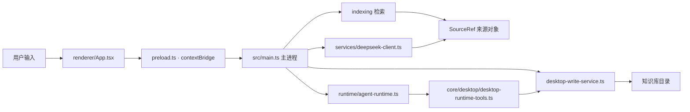

# 项目接手指南

> 面向第一次接触本项目、TypeScript 和 Agent 的接手者。读完本文应能知道项目为何存在、代码从哪里启动、每个目录负责什么、如何本地调试，以及怎样安全地改功能。

## 1. 用一句话理解项目

这是一个本地优先的个人知识 Agent 桌面应用：它检索你选定的 Markdown 知识库、用 DeepSeek 回答、用 Tavily 补证，并能把笔记组织成知识地图或 LLM Wiki。

它不是通用聊天机器人。项目的重点是：**让模型参与个人知识库，但文件读取、外发、写入和来源记录仍由本地代码控制。**

原项目同时维护 Obsidian 插件端与 Electron 桌面端，两端能力逐渐分叉。现插件端已完全移除，只保留桌面端；共享内核放在 `core/`，不引用任何 Obsidian API。

## 2. 先记住这五条规则

1. `src/main.ts` 是 Electron 主进程入口，负责服务组装与 IPC；`src/renderer/App.tsx` 是唯一界面。
2. API Key 不在知识库里，而在应用数据目录的 `.env`：`DEEPSEEK_API_KEY`、`TAVILY_API_KEY`。
3. 默认允许整个知识库；用户填写“敏感目录”后，其中内容仍可本地使用，但不能发送给模型。
4. 所有写入都要先生成预览、再由用户确认。不要在服务里直接调用仓储的写方法绕过预览。
5. `dist/` 是构建产物，不能手改；改动后运行 `npm.cmd run build`。

## 3. 系统地图


```mermaid
flowchart LR
  U[用户输入] --> V[renderer/App.tsx]
  V --> P[preload.ts · contextBridge]
  P --> M[src/main.ts 主进程]
  M --> R[runtime/agent-runtime.ts]
  M --> I[indexing 检索]
  M --> D[services/deepseek-client.ts]
  M --> W[desktop-write-service.ts]
  I --> S[SourceRef 来源对象]
  D --> S
  R --> T[core/desktop/desktop-runtime-tools.ts]
  T --> W
  W --> FS[知识库目录]
```

调用关系：界面只负责展示会话、计划卡片与写入预览；主进程组装服务；`AgentRuntime` 决定执行什么；模型只输出计划与文本，任何模型都不能自行决定文件路径或写入动作。

## 4. 本地开发

```powershell
npm.cmd install
npm.cmd run dev      # 构建并启动 Electron
npm.cmd run typecheck
npm.cmd test
npm.cmd run build
```

`npm.cmd test` 使用 `vitest.config.ts`，与 `vite.config.ts` 分开，因为后者的 `root` 指向渲染层。

## 5. 目录与关键文件

| 路径 | 职责 |
| --- | --- |
| `src/main.ts` | 主进程：工作区生命周期、服务组装、IPC、Agent 运行时宿主 |
| `src/preload.ts` | 通过 contextBridge 暴露最小 API |
| `src/renderer/App.tsx` | 中文单对话界面、笔记目录、计划卡片、写入预览卡片 |
| `src/shared/desktop-api.ts` | 主进程与渲染层共享的类型契约 |
| `core/core/knowledge-repository.ts` | 只读知识库接口（可替换实现） |
| `core/policy/policy-engine.ts` | 所有读、外发、索引、写入的授权中心 |
| `core/indexing/` | Markdown 分块、检索、附件索引与批处理队列 |
| `core/runtime/` | Agent 运行时：工具目录、计划校验、状态机、执行器注册表、错误类型 |
| `core/desktop/` | 桌面端服务：问答、写入、Wiki、附件、会话、关联、维护分析、知识地图 |
| `core/services/` | DeepSeek / Tavily / Vision 客户端与请求适配 |
| `core/actions/` | 写入提案与渲染（安全文件名、来源去重） |
| `core/wiki/` | LLM Wiki 编译、检索与覆盖核验 |

## 6. 关键流程

### 6.1 Agent 计划执行

1. 用户在输入框点“生成计划”，渲染层调用 `agent:plan-run`。
2. 主进程组装运行时并调用 `DesktopAgentRuntime.plan()`，由 DeepSeek 提出至多四步计划。
3. `agent-runtime.ts` 校验工具是否存在、组合是否重复、依赖顺序是否正确。
4. 计划卡片展示每一步；用户点“确认并执行”才调用 `agent:run-step`。
5. 步骤执行结果若带 `replanFeedback`，运行时会自动重规划一次，并排除已知无结果的动作。

### 6.2 受控写入

1. 工具执行器生成 `DesktopWritePreview`（目标路径、写前内容、写后内容），不写盘。
2. 渲染层展示预览差异；用户点“确认写入”后调用 `write:apply-previews`。
3. `DesktopWriteService.apply()` 二次检查权限，并确认文件自预览后未被修改。

### 6.3 问答与补证

本地检索优先。`research:answer-vault` 使用 `local-only` 模式：证据不足时抛 `LocalKnowledgeUnavailableError`，由运行时改为联网补证，而不是重复同一本地查询。

## 7. 数据边界

| 位置 | 内容 | 是否可删 |
| --- | --- | --- |
| 应用数据目录 `.env` | API Key | 可删；对应功能需重填 |
| Electron 用户数据目录 | 工作区路径、会话与附件索引状态 | 可删；会丢运行状态 |
| 知识库 Markdown/图片/PDF | 用户事实来源 | 不应由缓存逻辑删除 |
| `00 Inbox/Agent/`、`daily/`、知识体系目录 | 确认后写入的真实笔记 | 由用户管理 |

## 8. 如何安全地改常见需求

**新增一项权限**：在 `POLICY_ACTIONS` 与 `PermissionPolicy.enabled` 增加动作 → 在 `PolicyEngine.decide()` 加分支 → 在真正执行前调用 `decide()`。

**新增一个 Agent 能力**：在 `agent-runtime.ts` 的 `AGENT_TOOL_DEFINITIONS` 注册工具动作 → 在 `desktop-runtime-tools.ts` 提供执行器 → 若涉及写入，执行器只生成预览。注意 `AgentToolRegistry` 构造时会校验所有动作是否都有执行器，缺一个就会抛错。

**新增一种写入**：扩展 `DesktopWriteService`（`preparePreview` + `apply`），不要在服务里直接写仓储。

**更换模型或检索服务**：改 `core/services/` 对应客户端，HTTP 共享行为留在 `json-post.ts` / `fetch-api-request.ts`；不要把请求散到主进程或界面文件。

## 9. 发布前检查单

- [ ] `npm.cmd run typecheck` 通过。
- [ ] `npm.cmd test` 全部通过。
- [ ] `npm.cmd run build` 成功。
- [ ] 没有提交真实 `.env`、知识库样本或私密 PDF/图片。
- [ ] 手测：模型连通性、检索、问答计划、写入预览确认、敏感目录阻断、图片处理。

## 10. 已知限制

1. 检索是 BM25 打分（中文二元切分 + IDF + 词频饱和 + 长度归一）+ 结构化信号重排（标签、双链、目录、祖先标题、当前打开笔记的邻近度），未接入向量/语义检索，也没有查询改写。极小知识库（个位数笔记）里 IDF 样本不足，泛词仍可能占优；同义词/说法不同（"费用太贵" vs "成本高昂"）字面检索仍然召回不到。
2. PDF 当前不由模型解析。
3. 尚无 CI、端到端测试与示例知识库。
